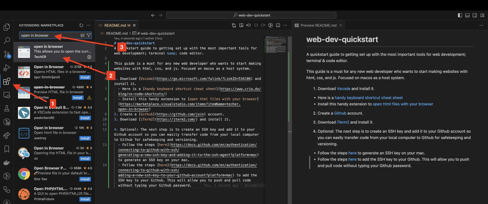

# web-dev-quickstart
A quickstart guide to getting set up with the most important tools for web development; terminal &amp; code editor.

This guide is a must for any new web developer who wants to start making websites with html, css, and js. Focused on macos as a host system.

1. Download [Vscode](https://go.microsoft.com/fwlink/?LinkID=534106) and install it.
  - Here is a [handy keyboard shortcut cheat sheet](https://www.crio.do/blog/vs-code-shortcuts/)
  - Install this handy extension to [open html files with your browser](https://marketplace.visualstudio.com/items?itemName=techer.open-in-browser)
  - The image below shows how to search for and install extensions to adapt vscode to your needs.
  - 
  - With this extension you can hit `option` + `b` to automatically open an html file in your browser. See gif below.
  - 
2. Create a [Github](https://github.com/join) account.
3. Download [iTerm2](https://iterm2.com/) and install it.
  - This will be used extensively later with React and when getting into backend Javascript, NodeJS.
4. Optional: This will be more important later when you want to save versions of your code, so no need to do it now. Create an SSH key and add it to your Github account so you can easily transfer code from your local computer to Github for safekeeping and versioning.
  - Follow the steps [here](https://docs.github.com/en/authentication/connecting-to-github-with-ssh/generating-a-new-ssh-key-and-adding-it-to-the-ssh-agent?platform=mac) to generate an SSH key on your mac.
  - Follow the steps [here](https://docs.github.com/en/authentication/connecting-to-github-with-ssh/adding-a-new-ssh-key-to-your-github-account?platform=mac) to add the SSH key to your Github. This will allow you to push and pull code without typing your Github password.